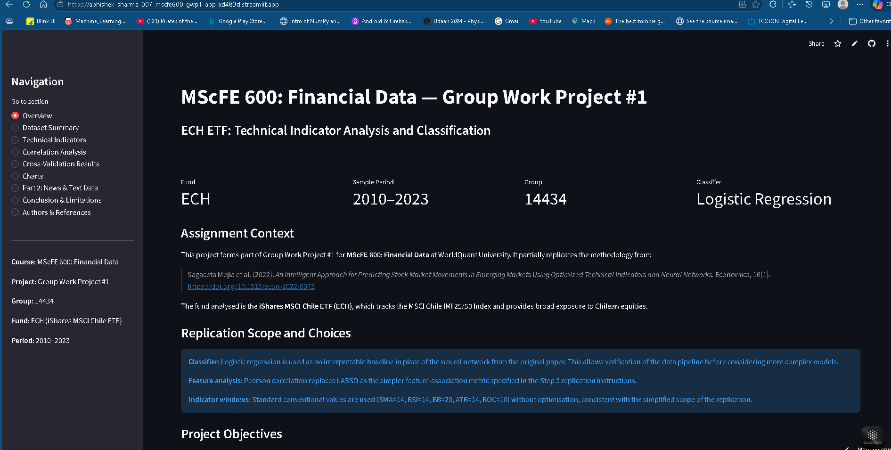
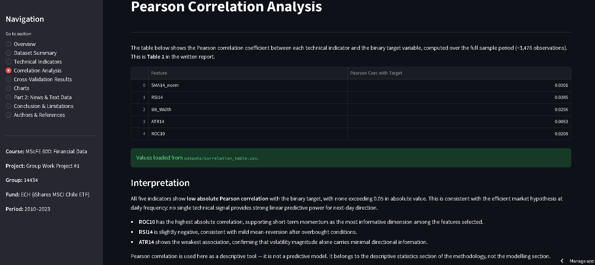
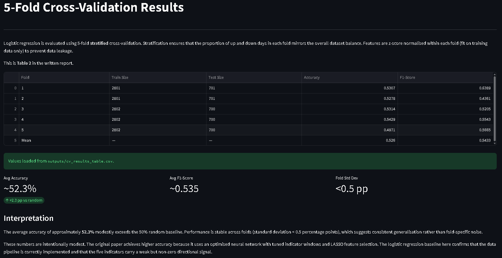
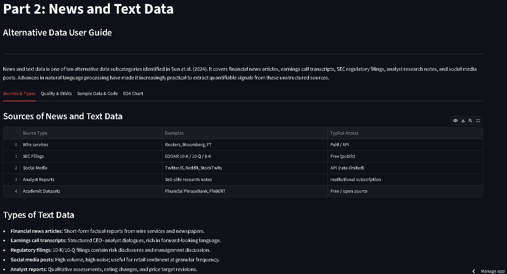

# MScFE 600 — Group Work Project #1
## ECH ETF: Technical Indicator Analysis and Classification

**WorldQuant University | MScFE 600: Financial Data | Group 14434**  
*Abhishek Sharma*

---

## Live App

[Open the Streamlit App](https://abhishek-sharma-007-mscfe600-gwp1-app-xd483d.streamlit.app/)

[](https://abhishek-sharma-007-mscfe600-gwp1-app-xd483d.streamlit.app/)

---
## Overview

This repository contains the complete submission for Group Work Project #1 of
MScFE 600: Financial Data. The project partially replicates the methodology
from Sagaceta Mejia et al. (2022), applying technical indicator-based binary
classification to the **iShares MSCI Chile ETF (ECH)** over the period
January 2010 – December 2023.

The analysis also includes a user guide for **News and Text Data** as an
alternative data category, supported by a Python demonstration and exploratory
data analysis (Part 2 of the assignment).

---

## Assignment Context

> Sagaceta Mejia, A., et al. (2022). *An Intelligent Approach for Predicting
> Stock Market Movements in Emerging Markets Using Optimized Technical Indicators
> and Neural Networks.* Economics, 16(1).
> https://doi.org/10.1515/econ-2022-0073

The assignment asks students to:
- Understand data, methodology, features, and evaluation from the paper
- Apply the approach to one of three ETFs (ECH, EQZ, or IVV)
- Use a simpler metric (Pearson correlation) and classifier (logistic regression)
- Evaluate with k-fold cross-validation
- Write a user guide for one category of alternative data

---

## Objectives

- Compute five standard technical indicators from OHLCV price data
- Define and predict a binary next-day direction target
- Assess linear associations using Pearson correlation
- Evaluate classification performance with 5-fold cross-validation
- Demonstrate a Python workflow for financial news/text data

---

## Methodology Summary

| Step | Choice | Reason |
|------|--------|--------|
| Fund | ECH (iShares MSCI Chile ETF) | Emerging market exposure |
| Period | 2010-01-01 to 2023-12-31 | 14-year history, multiple cycles |
| Features | SMA14_norm, RSI14, BB_Width, ATR14, ROC10 | Standard technical indicators |
| Target | +1 / −1 (next-day direction) | Binary classification formulation |
| Feature metric | Pearson correlation | Simpler alternative to LASSO |
| Classifier | Logistic regression | Interpretable, leakage-free baseline |
| Validation | 5-fold stratified CV, no shuffle | No data leakage, stable estimates |
| Alt. data | News and Text Data (Part 2) | Widely applicable, rich literature |

---

## Project Structure

```
mscfe600-gwp1/
│
├── README.md                  ← This file
├── requirements.txt           ← Python dependencies
├── run_analysis.py            ← Run this first to generate all outputs
├── app.py                     ← Streamlit dashboard
│
├── src/
│   ├── __init__.py
│   ├── data_loader.py         ← Yahoo Finance download and validation
│   ├── indicators.py          ← Technical indicator computation
│   ├── modeling.py            ← Target variable and CV pipeline
│   ├── evaluation.py          ← Pearson correlation and result formatting
│   ├── text_data_demo.py      ← Part 2: news data creation and EDA
│   └── utils.py               ← Figure generation and I/O helpers
│
├── notebooks/
│   └── GWP1_Notebook.ipynb    ← Full analysis notebook (Google Colab compatible)
│
├── data/
│   └── sample_news_data.csv   ← Sample financial news dataset (Part 2)
│
├── outputs/                   ← Generated by run_analysis.py
│   ├── figure1_ech_sma14.png
│   ├── figure2_ech_rsi14.png
│   ├── figure3_part2_eda.png
│   ├── correlation_table.csv
│   └── cv_results_table.csv
│
└── docs/
└── screenshots/               ← Written report (not tracked in git)
    ├── app_overview.png
    ├── app_correlation.png
    ├── app_cv_results.png
    └── app_part2.png      
```

---

## Setup

**Requirements:** Python 3.9+

```bash
# 1. Clone the repository
git clone https://github.com/your-username/mscfe600-gwp1.git
cd mscfe600-gwp1

# 2. Create a virtual environment (recommended)
python -m venv venv
source venv/bin/activate        # Windows: venv\Scripts\activate

# 3. Install dependencies
pip install -r requirements.txt
```

---

## How to Run

### Step 1 — Generate all outputs

```bash
python run_analysis.py
```

This downloads ECH data, computes all indicators, runs cross-validation,
saves the two tables as CSVs, and saves all three figures as PNG files to
the `outputs/` directory.

### Step 2 — Launch the Streamlit dashboard

```bash
streamlit run app.py
```

```markdown
A public deployed version of the dashboard is also available here:

[Streamlit Cloud App](https://abhishek-sharma-007-mscfe600-gwp1-app-xd483d.streamlit.app/)

Open the URL shown in the terminal (usually `http://localhost:8501`).

### Step 3 — Run the notebook

Open `notebooks/GWP1_Notebook.ipynb` in Google Colab or Jupyter and run
all cells top to bottom.

---

## Key Findings

### Part 1: ECH ETF Analysis

**Dataset:** 3,502 observations after cleaning | Target: 50.2% up / 49.8% down

**Figure 1 — ECH Adjusted Close Price with 14-Day SMA**


*ECH adjusted close price (blue) with 14-day SMA overlay (orange), 2010–2023.
Price ranged from approximately 14 USD (COVID low, March 2020) to ~55 USD (commodity peak, 2011).*

---

**Figure 2 — ECH 14-Day RSI with Overbought/Oversold Thresholds**


*14-day RSI (purple) with overbought threshold at 70 (red dashed) and oversold at 30 (green dashed).
RSI repeatedly enters oversold territory during major stress events: 2015 commodity decline, 2019 social unrest, and the March 2020 COVID crash.*

---

**Table 1 — Pearson Correlation (Features vs Target)**

| Feature | Pearson Corr. with Target |
|---------|--------------------------|
| SMA14_norm | 0.0301 |
| RSI14 | 0.0385 |
| BB_Width | 0.0256 |
| ATR14 | 0.0053 |
| ROC10 | 0.0208 |

All correlations are below 0.05, consistent with weak-form market efficiency at daily frequency.
**RSI14 shows the highest absolute correlation (0.0385)**, suggesting short-term price momentum
is the most informative linear signal among the five features. ATR14 is the weakest at 0.0053,
confirming that volatility magnitude alone carries minimal directional information.

---

**Table 2 — 5-Fold Cross-Validation (Logistic Regression)**

| Fold | Train Size | Test Size | Accuracy | F1-Score |
|------|-----------|-----------|----------|----------|
| 1 | 2,801 | 701 | 0.5307 | 0.6389 |
| 2 | 2,801 | 701 | 0.5278 | 0.4361 |
| 3 | 2,802 | 700 | 0.5314 | 0.5205 |
| 4 | 2,802 | 700 | 0.5429 | 0.5543 |
| 5 | 2,802 | 700 | 0.4971 | 0.5665 |
| **Mean** | — | — | **0.5260** | **0.5433** |

Average accuracy of **~52.6%** modestly exceeds the 50% random baseline.
Accuracy is consistent across folds, with Fold 4 being the strongest (0.5429) and Fold 5
dipping slightly below random (0.4971), reflecting the inherent noise in short-horizon
directional prediction. F1-scores show wider variation across folds (0.4361–0.6389),
indicating sensitivity to the class composition of individual test sets.

---

### Part 2: News and Text Data

**Figure 3 — Exploratory Analysis: Sample Financial News Data**


*Left: Sentiment label distribution (positive=8, negative=5, neutral=2).
Right: Top 10 most frequent non-trivial words in headlines.
Source: 15-record sample news dataset covering Chilean market events, January 2023.*

A structured Python workflow was demonstrated using a manually created 15-record
financial news dataset. The sentiment distribution shows 8 positive, 5 negative, and
2 neutral labels. The most frequent content words — growth, mining, bank, strong, equity —
reflect the commodity and macroeconomic focus of Chilean market news coverage.
The user guide covers sources, types, quality considerations, ethical issues, and a
literature review.

---

```markdown
## Screenshots

### Live Dashboard
[Open the deployed Streamlit dashboard](https://abhishek-sharma-007-mscfe600-gwp1-app-xd483d.streamlit.app/)

#### Overview


#### Correlation Analysis


#### Cross-Validation Results


#### Part 2: News & Text Data


---

## Recommended Images to Add to README

Add the following images and screenshots to improve the presentation of the repository:

| Image | Source | Purpose |
|-------|--------|---------|
| `outputs/figure1_ech_sma14.png` | Auto-generated by `run_analysis.py` | ECH price history with 14-day SMA overlay |
| `outputs/figure2_ech_rsi14.png` | Auto-generated by `run_analysis.py` | RSI14 with overbought and oversold thresholds |
| `outputs/figure3_part2_eda.png` | Auto-generated by `run_analysis.py` | Part 2 EDA for the sample news/text dataset |
| `docs/screenshots/app_overview.png` | Manual screenshot from deployed app | Live dashboard overview |
| `docs/screenshots/app_correlation.png` | Manual screenshot from deployed app | Correlation analysis section |
| `docs/screenshots/app_cv_results.png` | Manual screenshot from deployed app | Cross-validation results section |
| `docs/screenshots/app_part2.png` | Manual screenshot from deployed app | Part 2 alternative-data section |

---

## Limitations

- Logistic regression is used as a baseline in place of the paper's neural network
- Indicator windows are fixed at conventional values (no grid-search optimisation)
- Pearson correlation replaces LASSO for feature analysis
- No transaction costs are modelled
- Results are specific to ECH and the 2010–2023 period
- Part 2 uses a manually created 15-record news sample

---

## Future Improvements

- LASSO feature selection to match the paper's approach
- Neural network classifier for comparison with the logistic regression baseline
- Indicator window optimisation via grid search under cross-validation
- Extend analysis to EQZ and IVV for cross-fund comparison
- Incorporate daily news sentiment as an additional model feature
- Walk-forward cross-validation for more realistic deployment simulation

---

## Authors

| Name | Institution |
|------|-------------|
| Oluwatobi Dahunsi | WorldQuant University, MScFE |
| Abhishek Sharma | WorldQuant University, MScFE |
| Sarafa Busari | WorldQuant University, MScFE |

---

## References

1. Sagaceta Mejia, A., et al. (2022). *An Intelligent Approach for Predicting Stock Market
   Movements in Emerging Markets Using Optimized Technical Indicators and Neural Networks.*
   Economics, 16(1). https://doi.org/10.1515/econ-2022-0073

2. Sun, X., et al. (2024). *Alternative data in finance and business: emerging applications
   and theory analysis (review).* Journal of Finance and Data Science.
   https://doi.org/10.1186/s40854-024-00652-0

3. Tetlock, P.C. (2007). *Giving content to investor sentiment: The role of media in the
   stock market.* Journal of Finance, 62(3), 1139–1168.

4. Loughran, T., & McDonald, B. (2011). *When is a liability not a liability? Textual
   analysis, dictionaries, and 10-Ks.* Journal of Finance, 66(1), 35–65.

---

## Project Links

- **GitHub Repository:** https://github.com/Abhishek-Sharma-007/mscfe600-gwp1
- **Live Streamlit App:** https://abhishek-sharma-007-mscfe600-gwp1-app-xd483d.streamlit.app/

--- 

*MScFE 600: Financial Data | WorldQuant University | Group 14434*
