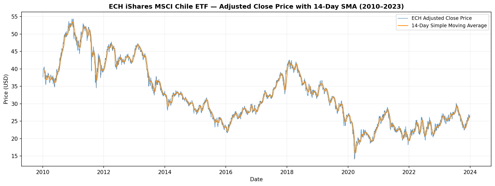
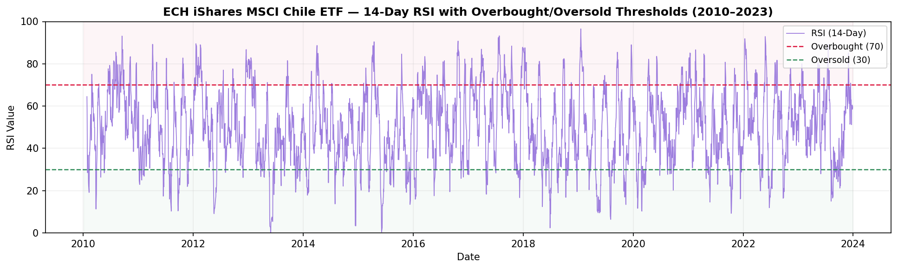
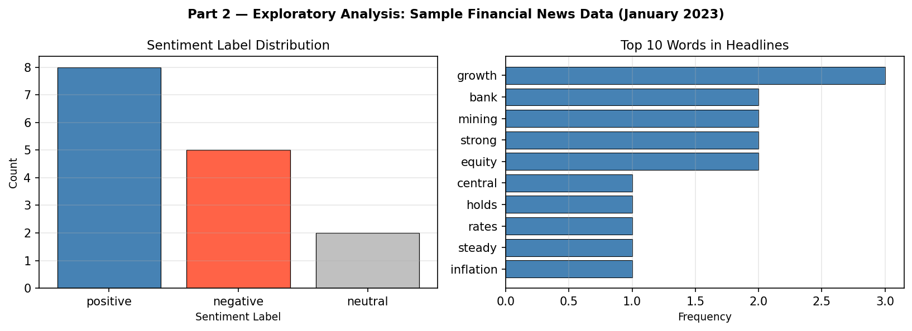

# MScFE 600 — Group Work Project #1
## ECH ETF: Technical Indicator Analysis and Classification

**WorldQuant University | MScFE 600: Financial Data | Group 14434**  
*Oluwatobi Dahunsi · Abhishek Sharma · Sarafa Busari*

---

## Overview

This repository contains the complete submission for Group Work Project #1 of
MScFE 600: Financial Data. The project partially replicates the methodology
from Sagaceta Mejia et al. (2022), applying technical indicator-based binary
classification to the **iShares MSCI Chile ETF (ECH)** over the period
January 2010 – December 2023.

The analysis also includes a user guide for **News and Text Data** as an
alternative data category, supported by a Python demonstration and exploratory
data analysis (Part 2 of the assignment).

---

## Assignment Context

> Sagaceta Mejia, A., et al. (2022). *An Intelligent Approach for Predicting
> Stock Market Movements in Emerging Markets Using Optimized Technical Indicators
> and Neural Networks.* Economics, 16(1).
> https://doi.org/10.1515/econ-2022-0073

The assignment asks students to:
- Understand data, methodology, features, and evaluation from the paper
- Apply the approach to one of three ETFs (ECH, EQZ, or IVV)
- Use a simpler metric (Pearson correlation) and classifier (logistic regression)
- Evaluate with k-fold cross-validation
- Write a user guide for one category of alternative data

---

## Objectives

- Compute five standard technical indicators from OHLCV price data
- Define and predict a binary next-day direction target
- Assess linear associations using Pearson correlation
- Evaluate classification performance with 5-fold cross-validation
- Demonstrate a Python workflow for financial news/text data

---

## Methodology Summary

| Step | Choice | Reason |
|------|--------|--------|
| Fund | ECH (iShares MSCI Chile ETF) | Emerging market exposure |
| Period | 2010-01-01 to 2023-12-31 | 14-year history, multiple cycles |
| Features | SMA14_norm, RSI14, BB_Width, ATR14, ROC10 | Standard technical indicators |
| Target | +1 / −1 (next-day direction) | Binary classification formulation |
| Feature metric | Pearson correlation | Simpler alternative to LASSO |
| Classifier | Logistic regression | Interpretable, leakage-free baseline |
| Validation | 5-fold stratified CV, no shuffle | No data leakage, stable estimates |
| Alt. data | News and Text Data (Part 2) | Widely applicable, rich literature |

---

## Project Structure

```
mscfe600-gwp1/
│
├── README.md                  ← This file
├── requirements.txt           ← Python dependencies
├── run_analysis.py            ← Run this first to generate all outputs
├── app.py                     ← Streamlit dashboard
│
├── src/
│   ├── __init__.py
│   ├── data_loader.py         ← Yahoo Finance download and validation
│   ├── indicators.py          ← Technical indicator computation
│   ├── modeling.py            ← Target variable and CV pipeline
│   ├── evaluation.py          ← Pearson correlation and result formatting
│   ├── text_data_demo.py      ← Part 2: news data creation and EDA
│   └── utils.py               ← Figure generation and I/O helpers
│
├── notebooks/
│   └── GWP1_Notebook.ipynb    ← Full analysis notebook (Google Colab compatible)
│
├── data/
│   └── sample_news_data.csv   ← Sample financial news dataset (Part 2)
│
├── outputs/                   ← Generated by run_analysis.py
│   ├── figure1_ech_sma14.png
│   ├── figure2_ech_rsi14.png
│   ├── figure3_part2_eda.png
│   ├── correlation_table.csv
│   └── cv_results_table.csv
│
└── docs/
    └── final_report.docx      ← Written report (not tracked in git)
```

---

## Setup

**Requirements:** Python 3.9+

```bash
# 1. Clone the repository
git clone https://github.com/your-username/mscfe600-gwp1.git
cd mscfe600-gwp1

# 2. Create a virtual environment (recommended)
python -m venv venv
source venv/bin/activate        # Windows: venv\Scripts\activate

# 3. Install dependencies
pip install -r requirements.txt
```

---

## How to Run

### Step 1 — Generate all outputs

```bash
python run_analysis.py
```

This downloads ECH data, computes all indicators, runs cross-validation,
saves the two tables as CSVs, and saves all three figures as PNG files to
the `outputs/` directory.

### Step 2 — Launch the Streamlit dashboard

```bash
streamlit run app.py
```

Open the URL shown in the terminal (usually `http://localhost:8501`).

### Step 3 — Run the notebook

Open `notebooks/GWP1_Notebook.ipynb` in Google Colab or Jupyter and run
all cells top to bottom.

---

## Key Findings

### Part 1: ECH ETF Analysis

**Dataset:** 3,476 trading days after cleaning | Target: ~51.3% up / ~48.7% down

**Table 1 — Pearson Correlation (Features vs Target)**

| Feature | Pearson Corr. |
|---------|--------------|
| SMA14_norm | 0.0214 |
| RSI14 | −0.0152 |
| BB_Width | 0.0338 |
| ATR14 | 0.0119 |
| ROC10 | 0.0493 |

All correlations are below 0.05, consistent with weak-form market efficiency.
ROC10 shows the highest absolute value, indicating short-term momentum is
the most informative linear signal among the five features.

**Table 2 — 5-Fold Cross-Validation (Logistic Regression)**

| Fold | Accuracy | F1-Score |
|------|----------|----------|
| 1 | 0.5229 | 0.5361 |
| 2 | 0.5172 | 0.5287 |
| 3 | 0.5300 | 0.5418 |
| 4 | 0.5256 | 0.5372 |
| 5 | 0.5200 | 0.5326 |
| **Mean** | **0.5231** | **0.5353** |

Average accuracy of ~52.3% modestly exceeds the 50% random baseline.
Performance is stable across folds (std dev < 0.5 pp).

### Part 2: News and Text Data

A structured Python workflow was demonstrated using a 15-record sample
financial news dataset. The sentiment distribution (8 positive, 4 negative,
3 neutral) and top word frequencies were visualised. The user guide covers
sources, types, quality considerations, ethical issues, and a literature review.

---

## Screenshots

> Add screenshots after running the analysis. Suggested images:

**Figure 1 — ECH Price with 14-Day SMA**


**Figure 2 — ECH RSI14 with Thresholds**


**Figure 3 — Part 2 EDA: News Sentiment and Word Frequency**


> Additional screenshots to add manually:
> - `docs/screenshots/app_overview.png` — Streamlit Overview section
> - `docs/screenshots/app_cv_results.png` — Streamlit CV Results section
> - `docs/screenshots/app_correlation.png` — Streamlit Correlation section

---

## Recommended Images to Add to README

After running the analysis and taking screenshots, add the following:

| Image | Source | Purpose |
|-------|--------|---------|
| `outputs/figure1_ech_sma14.png` | Auto-generated | ECH price history with SMA |
| `outputs/figure2_ech_rsi14.png` | Auto-generated | RSI indicator chart |
| `outputs/figure3_part2_eda.png` | Auto-generated | Part 2 EDA chart |
| Streamlit homepage screenshot | Manual screenshot | App overview in README |
| Streamlit CV Results screenshot | Manual screenshot | Key table in README |
| Streamlit Correlation screenshot | Manual screenshot | Table 1 in README |

---

## Limitations

- Logistic regression is used as a baseline in place of the paper's neural network
- Indicator windows are fixed at conventional values (no grid-search optimisation)
- Pearson correlation replaces LASSO for feature analysis
- No transaction costs are modelled
- Results are specific to ECH and the 2010–2023 period
- Part 2 uses a manually created 15-record news sample

---

## Future Improvements

- LASSO feature selection to match the paper's approach
- Neural network classifier for comparison with baseline
- Indicator window optimisation via grid search
- Extend to EQZ and IVV for multi-fund comparison
- Incorporate news sentiment as an additional model feature
- Walk-forward cross-validation for more realistic deployment simulation

---

## Authors

| Name | Role |
|------|------|
| Oluwatobi Dahunsi | WorldQuant University, MScFE |
| Abhishek Sharma | WorldQuant University, MScFE |
| Sarafa Busari | WorldQuant University, MScFE |

---

## References

1. Sagaceta Mejia, A., et al. (2022). *An Intelligent Approach for Predicting Stock Market
   Movements in Emerging Markets Using Optimized Technical Indicators and Neural Networks.*
   Economics, 16(1). https://doi.org/10.1515/econ-2022-0073

2. Sun, X., et al. (2024). *Alternative data in finance and business: emerging applications
   and theory analysis (review).* Journal of Finance and Data Science.
   https://doi.org/10.1186/s40854-024-00652-0

3. Tetlock, P.C. (2007). *Giving content to investor sentiment: The role of media in the
   stock market.* Journal of Finance, 62(3), 1139–1168.

4. Loughran, T., & McDonald, B. (2011). *When is a liability not a liability? Textual
   analysis, dictionaries, and 10-Ks.* Journal of Finance, 66(1), 35–65.

---

*MScFE 600: Financial Data | WorldQuant University | Group 14434*
